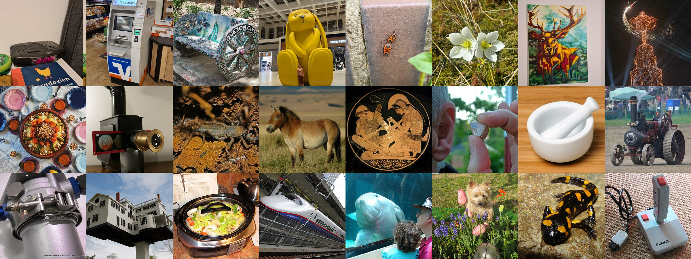

# NOVIC: Unconstrained Open Vocabulary Image Classification

[](https://paperswithcode.com/sota/open-vocabulary-image-classification-on-ovic?p=unconstrained-open-vocabulary-image)
[](https://paperswithcode.com/sota/open-vocabulary-image-classification-on-ovic-1?p=unconstrained-open-vocabulary-image)
[](https://paperswithcode.com/sota/open-vocabulary-image-classification-on-ovic-3?p=unconstrained-open-vocabulary-image)
[](https://paperswithcode.com/sota/open-vocabulary-image-classification-on-ovic-2?p=unconstrained-open-vocabulary-image)

**Main Author:** Philipp Allgeuer

Code release corresponding to the [WACV 2025 paper](https://www.arxiv.org/abs/2407.11211) (also on [paperswithcode](https://paperswithcode.com/paper/unconstrained-open-vocabulary-image)):

Philipp Allgeuer, Kyra Ahrens, and Stefan Wermter: *Unconstrained Open Vocabulary Image Classification: Zero-Shot Transfer from Text to Image via CLIP Inversion*

## Overview

**TL;DR:** Given an image and nothing else (i.e. no prompts or candidate labels), NOVIC can generate an accurate textual fine-grained classification label in *real-time*, with coverage of the vast majority of the English language.


NOVIC is an innovative uNconstrained Open Vocabulary Image Classifier that uses an autoregressive transformer to generatively output classification labels as language. Leveraging the extensive knowledge of CLIP models, NOVIC harnesses the embedding space to enable zero-shot transfer from pure text to images. Traditional CLIP models, despite their ability for open vocabulary classification, require an exhaustive prompt of potential class labels, restricting their application to images of known content or context. To address this, NOVIC uses an "object decoder" model that is trained on a large-scale 92M-target dataset of templated object noun sets and LLM-generated captions to always output the object noun in question. This effectively inverts the CLIP text encoder and allows textual object labels to be generated directly from image-derived embedding vectors, without requiring any a priori knowledge of the potential content of an image. NOVIC has been tested on a mix of manually and web-curated datasets, as well as standard image classification benchmarks, and achieves fine-grained prompt-free prediction scores of up to 87.5%, a strong result considering the model must work for any conceivable image and without any contextual clues.


At the heart of the NOVIC architecture is the *object decoder*, which effectively inverts the CLIP text encoder, and learns to map CLIP embeddings to object noun classification labels in the form of tokenized text. During training, a synthetic text-only dataset is used to train the object decoder to map the CLIP text embeddings corresponding to templated/generated captions to the underlying target object nouns. During inference, zero-shot transfer is used to map CLIP image embeddings (as opposed to text embeddings) to predicted object nouns. The ability of the object decoder to generalize from text embeddings to image embeddings is non-trivial, as there is a huge modality gap between the two types of embeddings (for all CLIP models), with the embeddings in fact occupying two completely disjoint areas of the embedding space, with much gap in-between.

## Datasets

In addition to a synthetic textual multiset dataset generated from the [Object Noun Dictionary](https://github.com/pallgeuer/object_noun_dictionary), caption-object pairs were also generated using an LLM, and are available here (see also [NOVIC Caption-Object Data](https://paperswithcode.com/dataset/novic-caption-object-data) on paperswithcode):

* [LLM-generated captions dataset (JSON)](https://www2.informatik.uni-hamburg.de/wtm/corpora/novic/captions_dataset.json): For more information, refer to the [paper](https://www.arxiv.org/abs/2407.11211) and the [dataset page](https://www.inf.uni-hamburg.de/en/inst/ab/wtm/research/corpora.html#novic)

Three datasets were also constructed and annotated for the purpose of testing open vocabulary image classification performance. These are available here (see also [OVIC Datasets](https://paperswithcode.com/dataset/ovic-datasets) on paperswithcode):

* [World](https://www2.informatik.uni-hamburg.de/wtm/corpora/ovic_datasets/world_dataset.zip): 272 images of which the grand majority are originally sourced (have never been on the internet) from 10 countries by 12 people, with an active focus on covering as wide and varied concepts as possible, including unusual, deceptive and/or indirect representations of objects,
* [Wiki](https://www2.informatik.uni-hamburg.de/wtm/corpora/ovic_datasets/wiki_dataset.zip): 1000 Wikipedia lead images sampled from a scraped pool of 18K,
* [Val3K](https://www2.informatik.uni-hamburg.de/wtm/corpora/ovic_datasets/val3k_dataset.zip): 3000 images from the ImageNet-1K validation set, sampled uniformly across the classes.



For more information, refer to the [paper](https://www.arxiv.org/abs/2407.11211) and the [open vocabulary image classification datasets page](https://www.inf.uni-hamburg.de/en/inst/ab/wtm/research/corpora.html#ovic-datasets). These datasets are distributed under the Creative Commons [CC BY-NC-SA 4.0](https://creativecommons.org/licenses/by-sa/4.0/) license.

## Citation

If you use this project in your research, please cite this GitHub repository as well as the WACV 2025 paper:

```bibtex
@Misc{github_novic,
    title = {{NOVIC}: {U}nconstrained Open Vocabulary Image Classification},
    author = {Philipp Allgeuer and Kyra Ahrens},
    url = {https://github.com/pallgeuer/novic},
}

@InProceedings{allgeuer_novic_2025,
    author    = {Philipp Allgeuer and Kyra Ahrens and Stefan Wermter},
    title     = {Unconstrained Open Vocabulary Image Classification: {Z}ero-Shot Transfer from Text to Image via {CLIP} Inversion},
    booktitle = {Proceedings of the IEEE/CVF Winter Conference on Applications of Computer Vision (WACV)},
    year      = {2025},
```
